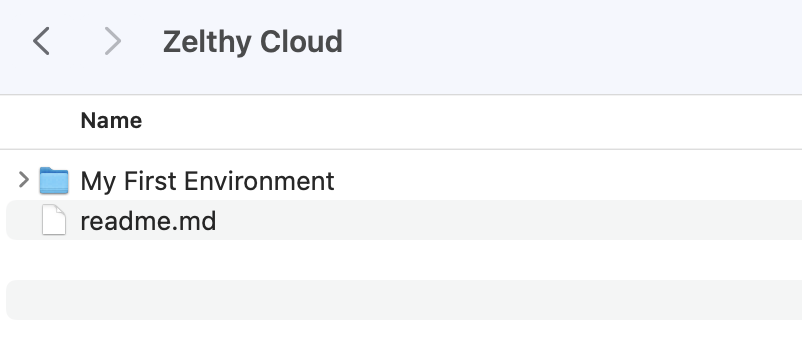

## Welcome to Zelthy Cloud's App Development Manual
   
You can think of an environment on Zelthy Cloud as a folder, you can think of an app in your Zelthy Cloud's environment as a folder. In fact, most objects within Zelthy Cloud can be imagined as a folder!

  

To build apps in Zelthy Cloud, you need to create your environment. Let's create your first folder i.e. your first environment on which you can host apps. Right click on your console and create your new environment... 

Well, nothing much happened and expectedly so. Folder creation in itself is just like reserving your preferred name for the object. Once you are inside the environment you just created, you can complete the setup and launch the actual environment.

Already inside your environment - [click here](Environment%201/env_setup.md)
